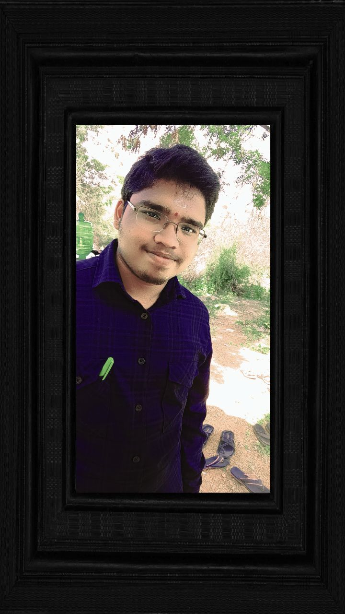
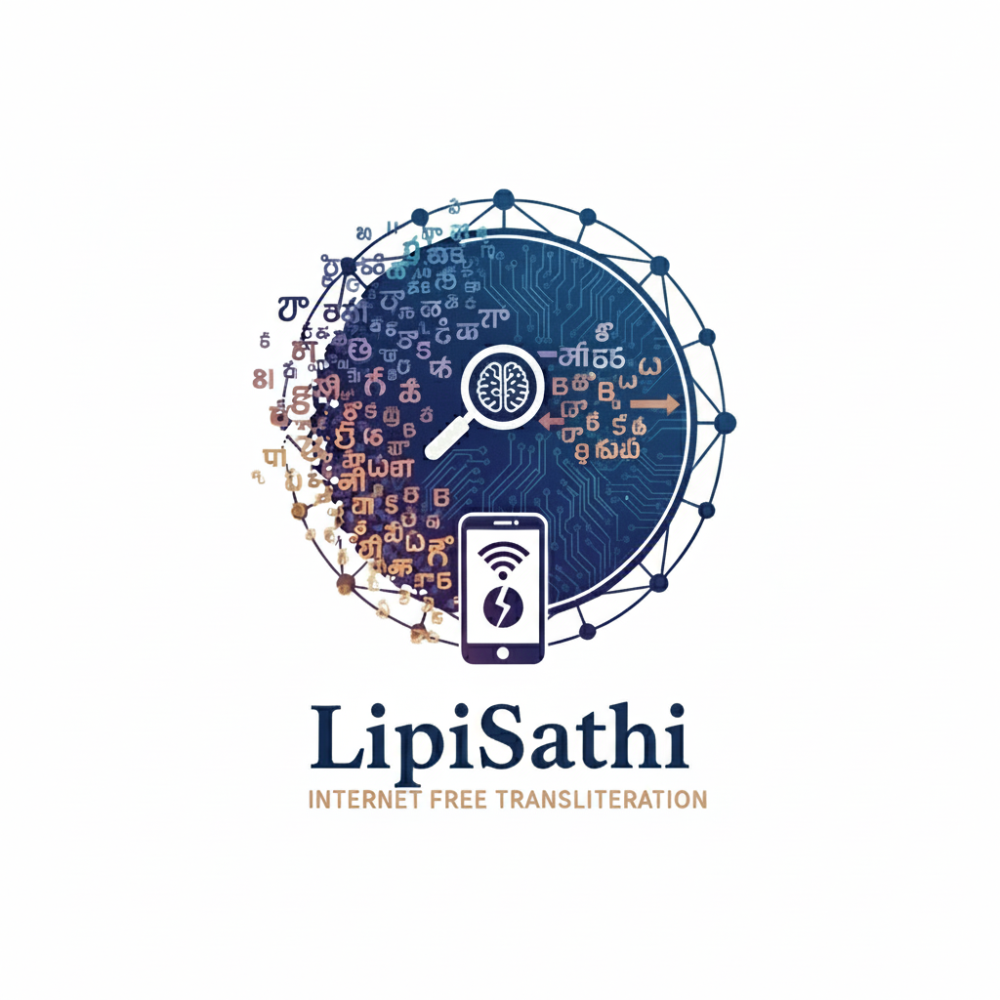
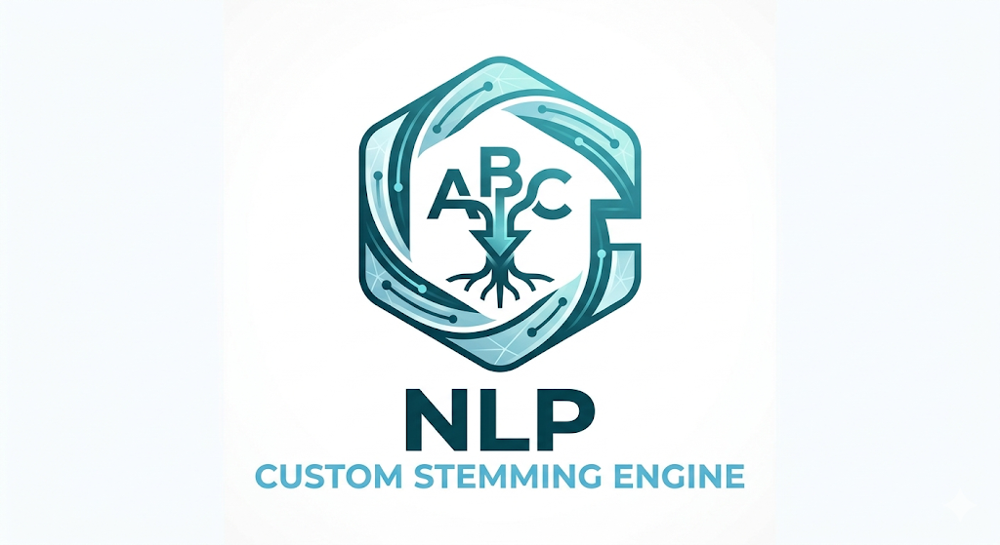
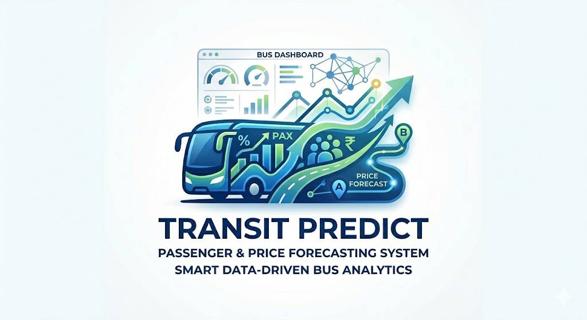

## [ADHIMULAM BHARGAV SAI VISWANATH](https://www.linkedin.com/in/adhimulambhargavsaiviswanath/)

B.Tech CSE - AI & ML Student at VVIT | Aspiring AI Engineer | Passionate about Machine Learning and Data Science

---

<!-- Visual-first, dark-themed snapshot: minimal text, informative visuals -->

  

### Visual Snapshot

  <!-- GitHub stats (dark) -->
  
  <!-- Top langs -->
  

  <!-- Trophies + Streak -->
  
  

### Quick Visual Facts

  
  
  
  

---

### Featured Projects (visual)

  
  
  

Hover project images for quick context on GitHub — visuals show project identity before you read details.

---

*This README emphasizes visuals: live GitHub stats, project thumbnails, and compact badges. If you want an animated banner GIF or a different arrangement (e.g., a 2-row project gallery, or an interactive SVG), tell me which images to use and I'll update it.*

*Maintained by Adhimulam Bhargav Sai Viswanath.*
